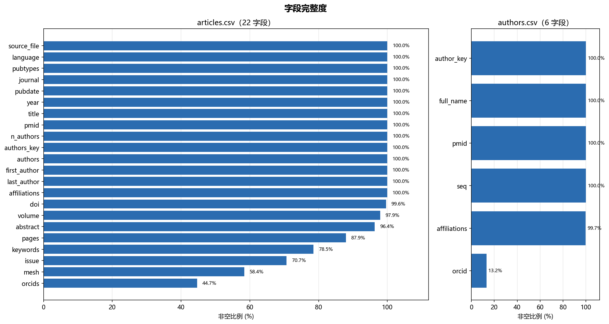
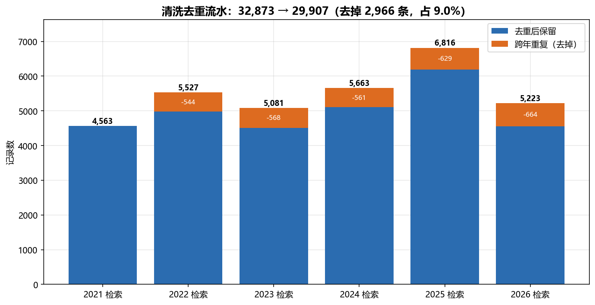
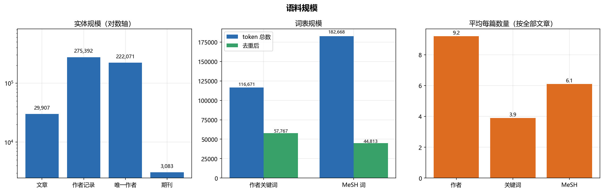
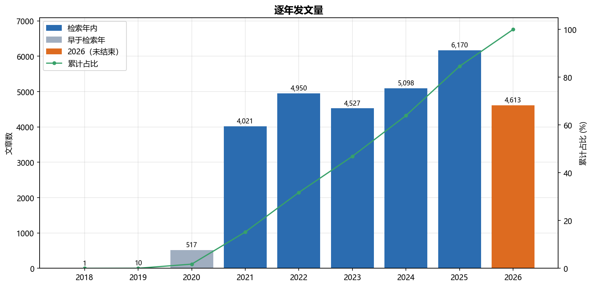
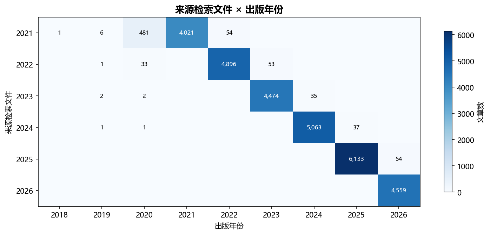
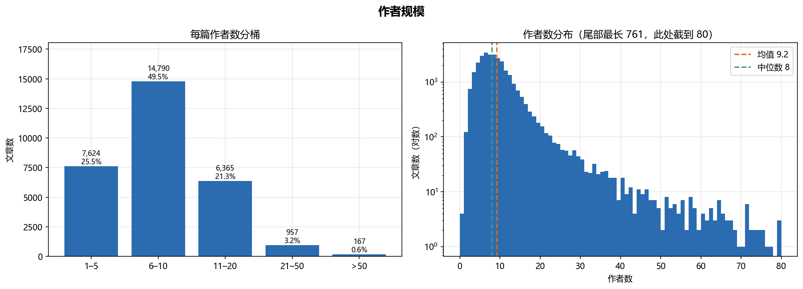
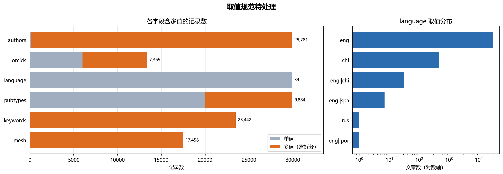

# 西安交通大学科研产出 · 数据预处理报告

> **数据源**：PubMed（`.nbib` 原始记录，2021–2026 逐年检索）
> **输入**：`data/raw/pubmed-XJTU-{2021..2026}.nbib`
> **输出**：`data/interim/articles.csv`、`data/interim/authors.csv`
> **配套脚本**：`notebooks/01_parse_nbib.ipynb`（解析）、`notebooks/preprocess_overview.ipynb`（本报告图表）
> **生成日期**：2026-10

---

## 1. 概述

本报告记录从 PubMed 原始记录到结构化分析数据表的预处理全过程与结果。

**一句话结论**：预处理把 6 个原始文件共 **32,873** 条记录，去重清洗成 **29,907 篇文章** 和
**275,392 条"作者 × 文章"记录**两张干净表，字段完整、可追溯、可复现。

核心数字：

| 指标 | 数值 |
|---|---|
| 原始记录（去重前） | 32,873 |
| 文章数（去重后） | 29,907 |
| 去掉的跨年重复 | 2,966（9.0%） |
| 作者记录数 | 275,392 |
| 唯一作者（消歧后） | 222,071 |
| 期刊数 | 3,083 |
| 出版年份范围 | 2018 – 2026 |

---

## 2. 数据来源与检索

- **数据库**：PubMed。
- **检索式**（基础）：`("Xi'an Jiaotong University"[Affiliation] OR "XJTU"[Affiliation])`，
  再按年份 `AND 年份[dp]` 逐年检索。
- **范围**：取全校（含交叉学科），不限定医学部。
- **导出**：因 PubMed 单次导出上限 1 万条，逐年导出为 `.nbib`。
- **原始记录数**：

  | 检索文件 | 原始记录 |
  |---|---:|
  | pubmed-XJTU-2021.nbib | 4,563 |
  | pubmed-XJTU-2022.nbib | 5,527 |
  | pubmed-XJTU-2023.nbib | 5,081 |
  | pubmed-XJTU-2024.nbib | 5,663 |
  | pubmed-XJTU-2025.nbib | 6,816 |
  | pubmed-XJTU-2026.nbib | 5,223 |
  | **合计** | **32,873** |

---

## 3. 预处理流程

与旧版（v1）最大的不同是 **直接解析 `.nbib`，不再经过 Zotero 中转**——避免信息损失（v1 中
MeSH 与作者关键词被合并、PMID 被替换），也让流程完全可复现。步骤：

1. **解析 `.nbib`**：按 MEDLINE 的 `标签 - 值` 格式逐条解析，提取 12 个核心字段
   （`PMID`、`TI`、`AB`、`FAU`、`AD`、`AUID`、`MH`、`OT`、`PT`、`DP`、`JT`、`LID`，
   其中 DOI 同时从 `AID` 兜底）。
2. **拆成两张表**：
   - `articles.csv`：一篇一行（29,907 行），多值字段用 `||` 拼接；
   - `authors.csv`：一位作者一行（275,392 行），保留署名顺序 `seq`，用 `pmid` 关联文章。
3. **按 PMID 去重**：合并六年记录，同一篇只保留一条。
4. **作者消歧**：生成 `author_key`——有 ORCID 用 `orcid:...`，否则用 `name:姓名 @ 单位`。
5. **输出**：清洗后的 CSV 表头使用 UTF-8（带 BOM），读取时用 `utf-8-sig`。

---

## 4. 数据字典

### 4.1 `articles.csv`（22 列）

| 列名 | 中文含义 | 类型 |
|---|---|---|
| `pmid` | PubMed 唯一编号（主键） | 主键 |
| `doi` | 数字对象标识符 DOI | 文本 |
| `title` | 文章标题 | 文本 |
| `abstract` | 摘要 | 长文本 |
| `authors` | 全部作者（`\|\|` 分隔，姓, 名） | 多值文本 |
| `first_author` | 第一作者 | 文本 |
| `last_author` | 末位作者（通常为通讯作者） | 文本 |
| `n_authors` | 作者总数 | 数值 |
| `orcids` | 作者 ORCID（`\|\|` 分隔） | 多值文本 |
| `affiliations` | 作者单位（去重后合并） | 长文本 |
| `mesh` | MeSH 主题词（受控词，`\|\|` 分隔） | 多值文本 |
| `keywords` | 作者关键词（自由词，`\|\|` 分隔） | 多值文本 |
| `pubtypes` | 出版类型（`\|\|` 分隔） | 多值文本 |
| `journal` | 期刊全名 | 文本 |
| `pubdate` | 出版日期（原始字符串） | 文本 |
| `year` | 出版年份（从 `pubdate` 提取） | 数值 |
| `language` | 语言（`\|\|` 分隔） | 多值文本 |
| `volume` | 卷 | 文本 |
| `issue` | 期 | 文本 |
| `pages` | 页码 | 文本 |
| `source_file` | 来源 nbib 文件 | 分类 |
| `authors_key` | 作者消歧键拼接（姓名 + 单位） | 长文本 |

### 4.2 `authors.csv`（6 列）

| 列名 | 中文含义 | 类型 |
|---|---|---|
| `pmid` | 关联文章 PMID | 外键 |
| `seq` | 署名顺序（1 = 第一作者） | 数值 |
| `full_name` | 作者全名 | 文本 |
| `orcid` | 作者 ORCID（可空） | 文本 |
| `affiliations` | 该作者的署名单位 | 长文本 |
| `author_key` | 消歧后的作者 ID（ORCID 或 姓名+单位） | 标识 |

---

## 5. 数据质量评估

### 5.1 字段完整度

**每个字段都可用，低覆盖主要来自 PubMed 本身的可选字段**，不代表清洗失败：

| 覆盖率偏低字段 | 覆盖率 | 原因 |
|---|---:|---|
| `orcids` | 44.7% | 只有注册了 ORCID 的作者才有 |
| `mesh` | 58.4% | 只有被 MEDLINE 完成标引的记录才有主题词 |
| `issue` | 70.7% | 电子优先发表的文章尚未分配期号 |
| `keywords` | 78.5% | 部分期刊不要求作者关键词 |
| `pages` | 87.9% | 电子优先发表常只有文章号 |
| `abstract` | 96.4% | 少部分记录无摘要 |

关键字段 `pmid`、`title`、`authors`、`journal`、`year`、`affiliations` 等覆盖率均约 100%。

### 5.2 去重效果

逐年检索会因电子版/纸质版日期差异产生跨年重复，按 **PMID 去重**后：

| 检索文件 | 原始记录 | 去重后保留 | 去掉重复 |
|---|---:|---:|---:|
| 2021 | 4,563 | 4,563 | 0 |
| 2022 | 5,527 | 4,983 | 544 |
| 2023 | 5,081 | 4,513 | 568 |
| 2024 | 5,663 | 5,102 | 561 |
| 2025 | 6,816 | 6,187 | 629 |
| 2026 | 5,223 | 4,559 | 664 |
| **合计** | **32,873** | **29,907** | **2,966** |

去重率 **9.0%**。2021 文件保留 100%（它是"最早"的一年），重复全部落在后续年份文件里。

### 5.3 语料规模

| 维度 | 数值 |
|---|---|
| 文章数 | 29,907 |
| 作者记录（作者 × 文章） | 275,392 |
| 唯一作者（消歧后） | 222,071 |
| 唯一作者姓名（未消歧） | 87,724 |
| 期刊数 | 3,083 |
| 作者关键词 token / 去重后 | 116,671 / 57,767 |
| MeSH 词 token / 去重后 | 182,668 / 44,813 |
| 平均每篇作者数 / 关键词数 / MeSH 数 | 9.2 / 3.9 / 6.1 |
| 作者 ORCID 覆盖率 | 13.2% |

---

## 6. 数据构成

### 6.1 逐年发文量

| 年份 | 文章数 | 占比 |
|---|---:|---:|
| 2018 | 1 | 0.0% |
| 2019 | 10 | 0.0% |
| 2020 | 517 | 1.7% |
| 2021 | 4,021 | 13.4% |
| 2022 | 4,950 | 16.6% |
| 2023 | 4,527 | 15.1% |
| 2024 | 5,098 | 17.0% |
| 2025 | 6,170 | 20.6% |
| 2026 | 4,613 | 15.4% |

> 注意两个"非检索年"：**2020 及更早（528 篇）**是电子优先发表溢出；
> **2026（4,613 篇）**在检索时该年尚未结束，数量不完整。

### 6.2 来源检索文件 × 出版年份

对角线外即年份溢出。可以看出溢出是**双向**的：既有早年记录漏进来（如 2021 文件含 481 篇
2020 年文章），也有次年的电子优先发表被提前收录（如 2021 文件含 54 篇 2022 年文章）。

### 6.3 作者规模

| 每篇作者数 | 文章数 | 占比 |
|---|---:|---:|
| 1–5 | 7,624 | 25.5% |
| 6–10 | 14,790 | 49.5% |
| 11–20 | 6,365 | 21.3% |
| 21–50 | 957 | 3.2% |
| > 50 | 167 | 0.6% |

均值 9.2、中位数 8、**最大 761**（超大合作会把均值拉高，分析时建议同时看中位数）。
另有 **4 篇**文章作者数为 0（团体署名/勘误类），在 `authors.csv` 中无对应记录。

### 6.4 取值规范待处理

| 字段 | 含多值的记录数 | 说明 |
|---|---:|---|
| `authors` | 29,781 | 绝大多数文章为多作者 |
| `keywords` | 23,442 | 分析前需拆分 |
| `mesh` | 17,458 | 分析前需拆分，并剔除通用词 |
| `pubtypes` | 9,884 | 一篇可有多个出版类型 |
| `orcids` | 7,365 | 多作者各自 ORCID |
| `language` | 39 | 出现 `eng\|\|chi` 等组合值 |

`language` 取值：`eng` 29,401、`chi` 466、`eng||chi` 31、`eng||spa` 7、`rus` 1、`eng||por` 1。

---

## 7. 发现的问题与注意事项

1. **年份溢出（双向）**：`year` 字段里有 2020 及更早的 528 篇和 2026 年的 4,613 篇，做时间序列
   时要么明确过滤到 2021–2025，要么在图中标注为不完全年份。
2. **2026 不完整**：检索时该年未结束，涉及 2026 的趋势/占比会被低估。
3. **MeSH 覆盖率仅 58.4%**，且头部多为 `Humans`、`Male`、`Female` 等通用词，
   **做主题词共现前必须先剔除这类描述性词汇**，否则结论会被通用词淹没。
4. **作者消歧仍有局限**：`author_key` 依赖 ORCID（仅 13.2%）或"姓名 + 单位"，
   同名同单位仍可能被误并；作者维度的高产榜、合作网络需谨慎解读。
5. **多值字段必须先拆分**：`keywords`、`mesh`、`pubtypes`、`language` 等用 `||` 拼接，
   直接统计会得到错误结果。
6. **4 篇文章无作者记录**（团体署名/勘误），按作者维度聚合时会被漏掉。

---

## 8. 结论与下一步

预处理产出了两张结构清晰、字段完整、可复现的数据表，**已具备开展文献计量分析的条件**：

- **发文趋势**：逐年发文量（需先处理年份溢出）
- **研究热点**：作者关键词 / MeSH 共现（需先拆分并清洗）
- **合作网络**：机构、作者合作（作者维度需谨慎）
- **期刊分布**：高产期刊排名
- **交叉学科**：以期刊/主题词/单位识别非医学的交叉研究

下一步将在预处理基础上开展专题分析与可视化。
